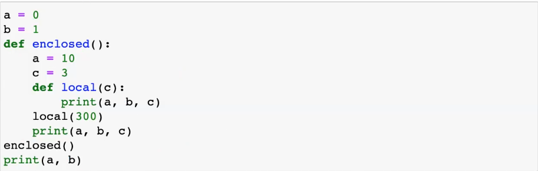
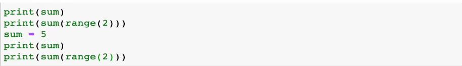

#  함수

함수란

특정한 기능을 하는 코드의 조각

높은 재사용성, 유지보수 용이

이름, 매개변수, 바디, 반환값(return)

함수의 선언은 def 키워드 활용

""" docstring """

매개변수를 설정할 수 있음

동작후에 return을 통해 반드시 하나의 객체를 반환

return에서도 함수 호출 가능

함수의 return

복수의 객체를 return하면 1개의 튜플로 나옴

return값이 없으면 None이 반환

input

매개변수 vs 전달인자

매개변수는 입력으로 받는 변수

위치인자는 호출시 넣는 값(가장 앞에 써야됨)

(정의할때)기본인자값 : 기본값을 지정하면 굳이 안넣어도됨 넣으면 그 값으로 변환

정의된것보다 적은 개수의 인자를 넣으면 나머지는 0으로 들어감

print는 end=\n이 기본

그래서 end = ''로 바꿔야 한줄로 출력됨

(호출할때)키워드 인자 - 직접 변수의 이름으로 특정인자를 전달 ex) x=2

순서바꿔도 상관없음

가변인자 리스트

키워드인자 다음에 위치인자를 사용할 수 없음

정해지지 않은 여러 개의 인자 처리 >> *사용

인자들을 튜플로 묶어 처리

바꿔도 되지만 *args 가 관례

가변 키워드 인자

**로 사용

인자들은 딕셔너리로 묶여 처리

**kwargs

함수 정의 주의 사향

def greeting(name = 'john doe', age):

error

기본인자값을 가지는 인자(키워드인자) 다음에 기본값이 없는 인자로 정의할 수 없음

add(*args, x) error

올바른 순서

y_info(x, y, *args, **kwargs)

함수 스코프

파이썬은 함수와 클래스만 스코프를 가짐

전역 스코프(global scope) : 코드 어디에서든 참조할 수 있는 공간

지역 스코프(local scope) : 함수가 만든 스코프. 함수 내부에서만 참조 가능

변수

전역 변수(global variable) : 전역 스코프에 선언된 변수

지역 변수(local variable) : 지역 스코프에 선언된 변수

변수 수명주기

빌트인 스코프 : 파이썬이 실행된 이후부터 영원히 유지

전역 스코프 : 모듈이 호출된 시점 이후 혹은 인터프리터가 끝날 때까지 유지

지역 스코프 : 함수가 호출될 떄 생성되고, 함수가 종료될 때까지 유지

함수 내에서는 바깥 스코프의 변수에 접근 가능하나 수정은 할 수 없음

LEGB Rule

global a

전역변수 지정

단순히 변경만 하는 것

nonlocal : 이미 존재하는 이름과의 연결만 가능

input에 * 사용하면 풀어서 넣어줌 언팩킹

재귀함수

자기 자신을 호출하는 함수

ex) 팩토리얼

재귀 함수는 base case에 도달할 때까지 함수를 호출함

최대 재귀 깊이 1000번을 넘기면 error 발생

