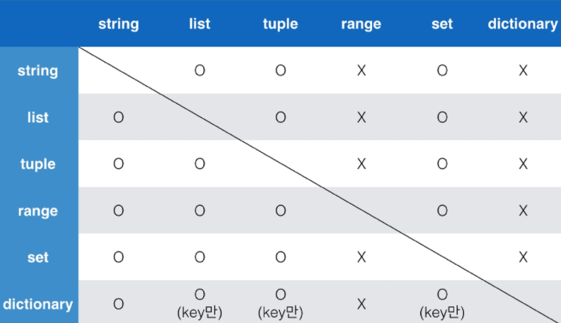

#  Python 정리


###  데이터 타입

#### 숫자 - int , float , complex

* 진수 표현 - 2진수 : 0b , 8진수 : 0o , 16진수 : 0x
* 실수의 경우 비교가 정확하지 않아 math.isclose 사용
* 허수는 .real 과 .imag 으로 구성


#### 문자열(string)

* 모든 문자는 str 타입
* ' ' 으로 표기
* 이스케이프 시퀀스 : 문자열 내에서 특정 문자나 조작을 위해 사용


#### 참/거짓(boolean)

0 , ( ) , [ ] , ' ' 은 모두 False로 변환

#### None

값이 없음을 표현하기 위한 타입

_____

###  연산자

####  산술 연산자

종류 : + , - , * , ** , / , // , %

####  비교 연산자

값을 비교하여, True / False 값을 리턴함

####  논리 연산자

and , or , Not

단축평가 : 결과가 확실한 경우 두번째 값은 확인하지 않음

#### Concatenation

숫자가 아닌 자료형에서도 + 를 사용할 수 있음


_____

###  컨테이너

여러개의 값을 저장할 수 있는 객체

시퀀스형과 비시퀀스형이 존재

* 시퀀스형 : 리스트, 튜플, 레인지, 문자형, 바이너리
* 비시퀀스형 : 세트, 딕셔너리

####  리스트

[ ] 를 통해 생성

값에 대한 접근은 list[i]

```
.append : 원소 마지막에 추가

.insert (i, j) : i 인덱스에 j값을 추가

del a[i] : i 인덱스의 값을 삭제

.remove(i) : i 를 삭제

.sort() : 오름차순 정렬

.sort(reverse=True) : 내림차순 정렬
```

####  튜플

수정 불가능한 시퀀스로 인덱스로 접근

( ) 로 생성

튜플은 일반적으로 파이썬 내부에서 활용

하나의 항목으로 구성된 튜플은 뒤에 쉼표를 붙여야함 (a = (1, ))

####  레인지

range는 숫자의 시퀀스를 나타내기 위해 사용

```
기본형 : range(n)
	0부터 n-1까지의 숫자의 시퀀스
범위 지정 : range(n,m)
	n부터 m-1까지의 숫자의 시퀀스
범위 및 스텝 지정 : rnage(n,m,s)
	n부터 m-1까지 s만큼 증가시키는 숫자의 시퀀스
```

####  시퀀스

시퀀스 포함 여부 확인 : in , not in

시퀀스 간 연결은 +

시퀀스의 길이 len()

max(), min()

.count() : 시퀀스에서의 특정 원소의 개수

#### 세트

순서가 없는 자료구조

{ }를 통해 생성

순서가 없어 별도의 값에 접근할 수 없음

집합과 동일한 구조

집합 연산자 사용 가능

세트를 활용하면 다른 컨테이너에서 중복된 값을 쉽게 제거할 수 있음(순서가 사라짐)

#### 딕셔너리

key와 value가 쌍으로 이뤄진 자료구조

{ } 혹은 dict()을 통해 생성

### 컨테이너 형변환




_____

###  제어문

####  조건문

if문은 참/거짓을 판단할 수 있는 조건식과 함꼐 사용


####  반복문

####  while문

조건식이 참인 경우 반복적으로 코드를 실행

####  for문

시퀀스를 포함한 순회가능한 객체요소를 모두 순회함

처음부터 끝까지 모두 순회하므로 별도의 종료조건이 필요하지 않음

####  반복문 제어

break : 반복문을 종료

continue : 이후의 코드 블록은 수행하지 않고, 다음 반복을 수행

for-else : 끝까지 반복문을 실행한 이후에 else문 실행

_____

###  예외 처리

try문 / except절을 이용하여 예외 처리를 할 수 있음

try 아래의 코드 블록이 실행됨

