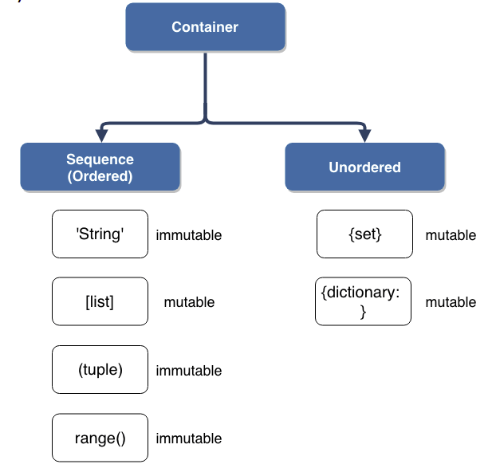

역슬래쉬쓰면 한줄을 여러줄로 쓸수 있음

식별자에 첫글자에 숫자 x

math.isclose

출력할수 있는 방법 3가지

%ㄴ %ㅜ믇

{} .format(name)

f'' {name}

세트 만들때 {} 불가능 무조건 set()

차지합 - 합집합 | 교집합 &

딕셔너리 키는 이뮤터블한 데이터만 가능

keys values items 튜플형태의 리스트로 만듬

형변환 하면 키만 나옴

변경불가능한것

숫자 글자 참거짓 range tuple frozenset

변경 가능한것

리스트 딕셔너리 세트

enumerate() idx 와 값을 함께 출력함 튜플로 나옴

else는 break로 종료될때는 실행되지 않음

함수 쓰는 이유 가독성 재사용성 유지보수

매개변수는 함수 정의할때 쓰고 전달인자는 실제 들어가는 값

기본인자값이쓴것은 맨 마지막에 둬야함

키워드인자도 마찬가지로 앞에 올수 없음

legb룰 로컬 인클로즈 글로벌 빌트인

반복문과 재귀함수의 차이 

재귀호출은 변수사용을 줄여줄수 있음  반복문이 더 빠름

에러파트 한번 보고 들어가자

문자열

find 없으면 -1

index 없으면 오류발생