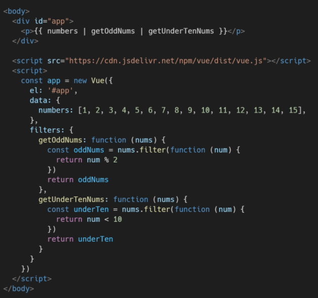
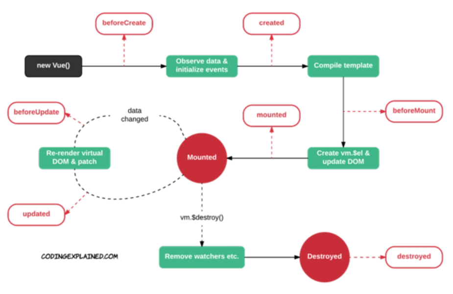

# Vue

## Vue.js

```
SPA(Single Page Application)을 완벽하게 지원
단일 페이지 애플리케이션
서버로부터 최초에만 페이지를 다운로드하고, 이후에는 동적으로 DOM을 구성

페이지 규모가 계속해서 커지고 있고 사용하는 데이터도 늘어나고 사용자와의 상호작용도 많이 이루어짐
Data를 변경하면 이에 연결된 DOM은 알아서 변경
```

#### CSR

```
Client Side Rendering
서버에서 화면을 구성하는 SSR 방식과 달리 클라이언트에서 화면을 구성
최초 요청 시 HTML, CSS, JS 등 데이터를 제외한 각종 리소스를 응답받고 이후 클라이언트에서는 필요한 데이터만 요청해 JS로 DOM을 렌더링
SPA가 사용하는 렌더링 방식

장점 : 서버와 클라이언트 간 트래픽 감소, 사용자 경험 향상
단점 : SSR에 비해 전체 페이지 렌더링 시점이 느림, SEO에 어려움이 있음(검색 엔진 최적화)
```

#### SSR

```
Server Side Rendering
서버에서 클라이언트에게 보여줄 페이지를 모두 구성하여 전달하는 방식
전통적인 렌더링 방식

장점 : 초기 구동 속도가 빠름, SEO에 적합(Search Engine Optimization)
단점 : 모든 요청마다 새로운 페이지를 구성하여 전달, 서버의 부담이 클 수 있음
```

#### MVVM Pattern

```
Model, View, View Model

Model : Vue에서 Model은 JavaScript Object이다
View : Vue 에서 View는 DOM이다
ViewModel : Vue에서 ViewModel은 모든 Vue Instance이다
```

#### 코드 작성 순서

```
Data가 변화하면 DOM이 변경
1. Data 로직 작성
2. DOM 작성
```

#### Basic syntax

```javascript
const app = new Vue ({
    el: '#app',
    data : {
    message: 'Hello', 
	},
    methods: {
        greeting: function () {
            console.log('Hello')
        }
    },
})
```

```
el : 연결할 기존 DOM 엘리먼트
data : Vue 인스턴스의 데이터 객체, this 키워드를 통해 접근 가능, 화살표 함수 사용 불가
methods : Vue 인스턴스에 추가할 메서드, v-on과 같은 directive에서도 사용 가능, Vue 객체 내 다른 함수에서 this 키워드를 통해 접근 가능

this 키워드
Vue 함수 객체 내에서 vue 인스턴스를 가리킴
화살표 함수를 사용하면 안되는 경우 : data, method 정의
```

### Template Syntax

```
Interpolation(보간법)

Text
{{ msg }}

Raw HTML
v-html

Attributes
v-bind:id

JS 표현식
{{ number + 1 }}
```

#### Directive

```
v- 접두사가 있는 특수 속성
표현식의 값이 변경될 때 반응적으로 DOM에 적용하는 역할을 함

전달인자(Arguments)
':' 을 통해 전달인자를 받을 수도 있음
수식어(Modifiers)
'.' 으로 표시되는 특수 접미사
directive를 특별한 방법으로 바인딩 해야 함을 나타냄
```

```
v-text
엘리먼트의 textContent를 업데이트

v-html
엘리먼트의 innerHTML을 업데이트
XSS 공격에 취약할 수 있음
사용자로부터 입력받은 내용은 절대 사용 금지

v-show
조건부 렌더링 중 하나
엘리먼트는 항상 렌더링 되고 DOM에 남아있음
단순히 엘리먼트에 display CSS 속성을 토글하는 것

v-if, v-else-if, v-else
조건부 렌더링 중 하나
directive의 표현식이 true일 때만 렌더링
삭제되고 다시 작성됨

v-for
원본 데이터를 기반으로 엘리먼트 또는 템플릿 블록을 여러 번 렌더링
item in items 구문 사용
item 위치의 변수를 각 요소에서 사용할 수 있음(객체의 경우 key)
v-for 사용 시 반드시 key 속성을 각 요소에 작성(:key)
v-if와 함께 사용하는 경우 v-for가 우선순위가 더 높음(가능하면 동시에 사용 X)

v-bind
HTML 요소의 속성에 Vue의 상태 데이터를 값으로 할당
Object 형태로 사용하면 value가 true인 key가 class 바인딩 값으로  할당
':' 으로 사용 가능

v-model
HTML form 요소의 값과 data를 양방향 바인딩
한글은 v-on으로 대체하여 사용
```

#### Option/Data

```
computed
데이터를 기반으로 하는 계산된 속성
종속된 데이터가 변경될 때만 함수를 실행
반드시 반환 값이 있어야 됨

computed & methods
computed은 종속된 대상이 변경되지 않으면 실행되지 않음
사용 시 ()이 필요없음(한번만 사용됨)

watch
데이터를 감시
데이터에 변화가 일어났을 때 실행되는 함수

computed & watch
computed
특정 데이터를 직접적으로 사용/가공하여 다른 값으로 만들 떄 사용
선언형 프로그래밍 방식

watch
특정 데이터의 변화 상황에 맞춰 다른 data 등이 바뀌어야 할 때 주로 사용
명령형 프로그래밍 방식
```

#### Option/Assets

```
filter
텍스트 형식화를 적용할 수 있는 필터
interpolation 혹은 v-bind를 이용할 떄 사용 가능
필터는 자바스크립트 표현식 마지막에 '|' 와 함께 사용
```



### Lifecycle Hooks

```

```



#### lodash library

```
array, object 등 자료구조를 다룰 때 사용하는 유용하고 간편한 유틸리티 함수들을 제공
```

