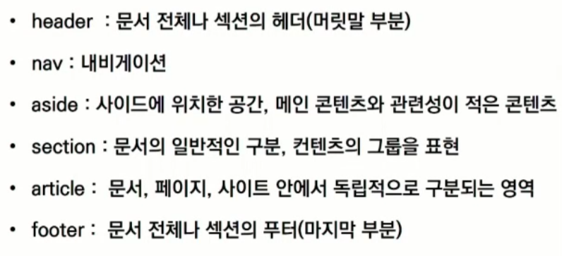

# HTML & CSS

```
현재의 웹 표준
- WHATWG
MDN - 웹 표준에 대한 문서
```


#  HTML

```
Hyper Text Markup Language
프로그래밍 언어와는 다르게 단순하게 데이터를 표현
웹 페이지를 작성하기 위한 언어

인라인 / 블록 요소
```


##  태그

```
그룹 컨텐츠
<p> - 문단, 블럭 요소
<hr> - 헤드라인, 줄 긋기
<ol> <ul> - 리스트
<pre> <blockquote> - 주석
<div> - 그룹화, 블럭 요소

텍스트 관련 요소
<a> - 링크
<b> VS <strong> - <b>는 굵게만 표시, <strong>은 강조의 의미
<i> VS <em>
<span> - 그룹화, 인라인 요소
<br> - 다음 단락
 - 이미지 태그

form
<form>은 서버에서 처리될 데이터를 제공하는 역할
<form>의 기본 속성
action - 어디로 보내는지
method

input
input 유형 - input 요소의 동작은 여러가지 타입에 따라 결정
```


##  마크업

```
구조
1. header
2. section
3. footer

head 요소
- 해당 문서 정보를 담고 있으며 브라우저에 나타나지 않음
- Open Graph Protocol(메타 데이터를 통해 문서의 정보를 전달)
body 요소 - 브라우저 화면에 나타나는 정보

DOM 트리
- Document Object Model
- 부모, 형제 관계
- 객체 지향 표현
```


##  HTML 기본 구조

```
요소 - 태그 사이에 위치한 내용
태그 - 요소를 감싸는 것
속성 - 태그의 속성을 변경

HTML Global Attribute - 모든 HTML 요소가 공통으로 사용할 수 있는 속성(몇몇 요소는 제외)
- id, class
- hidden
- lang
- style
- tabindex
- title
```

```
시맨틱 태그
HTML5에서 의미론적 요소를 담은 태그
기능을 가지진 않음(div와 같음)
```



