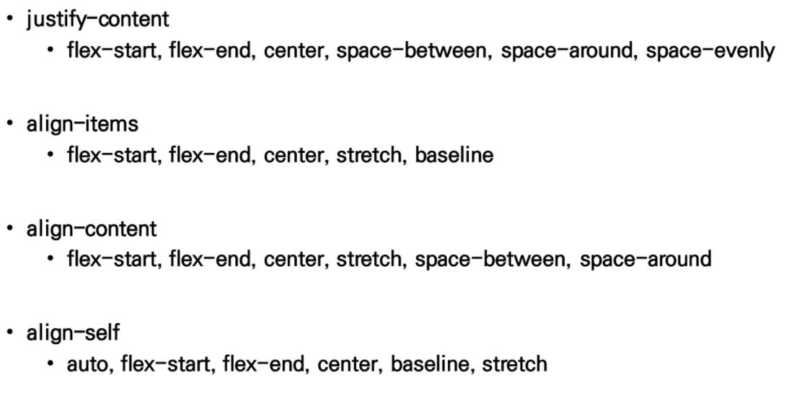

#  CSS layout

```
웹 페이지에 포함되는 요소들을 어떻게 취합하고 그것들이 어느 위치에 놓일 것인지를 제어
```

## Float

```
본래의 이미지를 한쪽으로 띄우고 텍스트를 둘러싸는 레이아웃

Float 속성
none, left, right

clearfix
clear: both - float가 공간을 차지하게 하기위해 사용
```

## Flexbox

```
아이템 간 공간배분과 강력한 정렬 기능을 제공

요소
- Flex Container(부모 요소)
- Flex Item(자식 요소)

축
- main axis(메인 축)
- cross axis(교차축)

Flex Container
- display 속성을 flex 혹은 inline-flex로 지정
Flex Item
- 컨테이너의 컨텐츠
```

```
배치 방향 설정 - flex-direction
메인축 방향 정렬 - justify-content
교차축 방향 정렬 - align-items, align-self, align-content
기타 
- flex-wrap(wrap - 넘치면 다음 줄로 보냄), flex-flow(shorthand로 방향과 wrap을 함께 설정), flex-grow(남은 공간을 분배), order(순서 -1,0,1)
```

### flex-direction

```
메인축 방향만 바뀜
flexbox는 단방향 레이아웃이기 때문
row - 가로
column - 세로
reverse - 반대
```

### justify & align

```
justify - 메인축 정렬
align - 교차축 정렬
```

### content & items & self

```
content - 여러 줄
items - 한 줄
self - flex item 개별 요소
```

