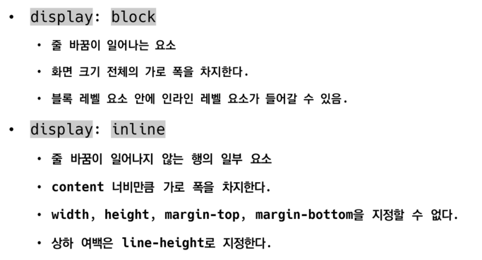

#  CSS

```
Cascading Style Sheets
스타일 , 레이아웃 등을 통해 문서(HTML)를 표시하는 방법을 지정하는 언어
HTML과 별개의 언어
```


## CSS 구문

```
선택자 안에 속성과 값의 형태
중괄호 안에서 속성과 값, 하나의 쌍으로 이루어진 선언을 진행

CSS 정의 방법
1. 인라인(inline) - 해당 태그에 직접 style 속성을 활용
2. 내부 참조 - head 태그 내에 <style>에 지정
3. 외부 참조 - 외부 CSS 파일을 <head>내 <link>를 통해 불러오기
```

### 선택자

```
기본 선택자
- 전체 선택자, 요소 선택자
- 클래스 선택자, 아이디 선택자, 속성 선택자

결합자
- 자손 결합자, 자식 결합자
- 일반 형제 결합자, 인접 형제 결합자

전체 선택자 - *로 표현
요소 선택자 - 태그를 선택
클래스 선택자 - .class로 선택, 모든 class를 변경
id 선택자 - #으로 선택, id는 중복될 수 없어 하나의 요소만 선택
자식 결합자 - 자기 자신의 직계 자식 요소만 선택, > 로 표현
자손 결합자 - 모든 자식 요소를 선택, 들여쓰기로 표현
```

### CSS 적용 우선순위

```
1. 중요도(Importance) - !important

2. 우선 순위(Specificity)
- 인라인 > id 선택자 > class 선택자 > 요소 선택자

3. 소스 순서 - 늦게 선언된 소스
```

### CSS 상속

```
CSS는 상속을 통해 부모 요소의 속성을 자식에게 상속

상속 되는 것 - Text 관련 요소(font, color, text-align, opacity)

상속 되지 않는 것
Box model 관련 요소 - width, height, margin, padding, border, display
Position 관련 요소 - position, top/right/bottom/left
```


## CSS 단위

```
크기 단위

px(픽셀) 
- 모니터 해상도의 한 화소인 '픽셀'을 기준
- 픽셀의 크기는 변하지 않기 때문에 고정적인 단위
%
- 백분율 단위
- 가변적인 레이아웃에서 자주 사용
em
- (바로 위, 부모 요소에 대한) 상속의 영향을 받음
- 배수 단위, 요소에 지정된 사이즈에 상대적인 사이즈를 가짐
rem
- (바로 위, 부모 요소에 대한) 상속의 영향을 받지 않음
- 최상위 요소(html)의 사이즈를 기준으로 배수 단위를 가짐
viewport
- 주로 스마트폰이나 태블릿 디바이스의 화면을 일컫는 용어
- 글자 그대로 디바이스의 viewport를 기준으로 상대적인 사이즈가 결정됨
```

```
색상 단위

1. 색상 키워드
- 대소문자를 구분하지 않음
- 특정 색을 직접 글자로 나타냄

2. RGB 색상
- 16진수 표기법 혹은 함수형 표기법을 사용해서 특정 색을 표현

3. HSL 색상
- 색상, 채도, 명도를 통해 특정 색을 표현

*a는 투명도를 설정
```

### 결합자

```
자손 결합자
자식 결합자
일반 형제 결합자 - 형제 요소 중 뒤에 위치하는 요소를 모두 선택, ~로 선택
인접 형제 결합자 - 형제 요소 중 바로 뒤에 위치하는 요소를 선택, +로 선택
```


## Box model

```
Margin - 테두리 바깥의 외부 영역, 배경색을 지정할 수 없음
Border - 테두리 영역
Padding - 테두리 안쪽의 내부 여백, 요소에 적용된 배경색, 이미지는 padding까지 적용
Content - 글이나 이미지 등 요소의 실제 내용

shorthand - 상하좌우, 상하/좌우, 상/좌우/하, 상/우/하/좌

box-sizing이 border-box - 기준을 content가 아닌 border로 정함

마진 상쇄 - 각각의 margin이 둘 중에서 큰 마진 값으로 결합되는 현상
```


##  CSS Display



```
블록 레벨 요소(기본은 너비의 100%)
div / ul, ol, li / p / hr / form
인라인 레벨 요소(컨텐츠 영역 만큼만)
span / a / img / input, label / b, em, i, strong
```

```
속성에 따른 수평 정렬
margin(블록 요소) - 마진 값과 정렬이 반대
text-align(인라인 요소)

display
- inline-block
두 요소의 특징을 모두 가짐
- none
화면에 표시하지 않고 공간조차 사라짐

visibility
- hidden
공간은 차지하고 화면에만 표시하지 않음
```


## CSS positoin

```
문서 상에서 요소를 배치하는 방법을 지정
static : 모든 태그의 기본 값(기준 위치)
- 일반적인 요소의 배치 순서에 따름(좌측 상단)
- 부모 요소 내에서 배치될 때는 부모 요소의 위치를 기준으로 배치 됨

아래는 좌표 프로퍼티(top, bottom, left, right)를 사용하여 이동이 가능(음수값도 가능)
- relative
- absolute
- fixed
```

```
relative : 상대 위치
- 자기 자신의 static 위치를 기준으로 이동
- 레이아웃에서 요소가 차지하는 공간은 static일 때와 같음

absolute : 절대 위치
- 요소를 일반적인 문서 흐름에서 제거 후 레이아웃에 공간을 차지하지 않음
- static이 아닌 가장 가까이 있는 부모/조상 요소를 기준으로 이동

fixed : 고정 위치
- 요소를 일반적인 문서 흐름에서 제거 후 레이아웃에 공간을 차지하지 않음
- 부모요소와 관계없이 viewport를 기준으로 이동
- 스크롤 시에도 항상 같은 곳에 위치함
```


## Modal

```javascript
// Modal.js
import React from "react";
 
function Modal(props) {
 
function closeModal() {
    props.closeModal();
  }
 
  return (
    <div className="Modal" onClick={closeModal}>
      <div className="modalBody" onClick={(e) => e.stopPropagation()}>
        <button id="modalCloseBtn" onClick={closeModal}>
          ✖
        </button>
        {props.children}
      </div>
    </div>
  );
}
 
export default Modal;

```

```css
/* modal창 외부화면 */
.Modal {
  position: fixed;
  top: 0;
  left: 0;
  width: 100%;
  height: 100%;
  background-color: rgba(0, 0, 0, 0.4);
  display: flex;
  justify-content: center;
  align-items: center;
}
 
/* modal창 */
.modalBody {
  position: absolute;
  width: 300px;
  height: 500px;
  padding: 40px;
  text-align: center;
  background-color: rgb(255, 255, 255);
  border-radius: 10px;
  box-shadow: 0 2px 3px 0 rgba(34, 36, 38, 0.15);
}
 
#modalCloseBtn {
  position: absolute;
  top: 15px;
  right: 15px;
  border: none;
  color: rgba(0, 0, 0, 0.7);
  background-color: transparent;
  font-size: 20px;
}
 
#modalCloseBtn:hover {
  cursor: pointer;
}
```

- 외부 스크롤 방지

```javascript
useEffect(() => {
  document.body.style.cssText = `
    position: fixed; 
    top: -${window.scrollY}px;
    overflow-y: scroll;
    width: 100%;`;
  return () => {
    const scrollY = document.body.style.top;
    document.body.style.cssText = '';
    window.scrollTo(0, parseInt(scrollY || '0', 10) * -1);
  };
}, []);

```

